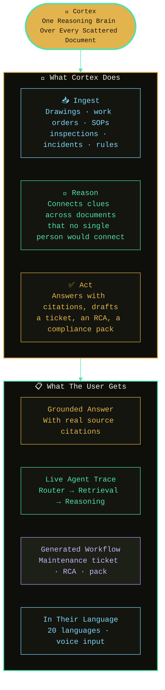
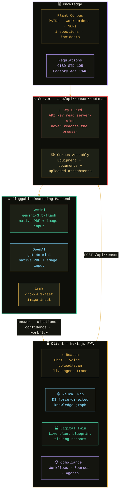
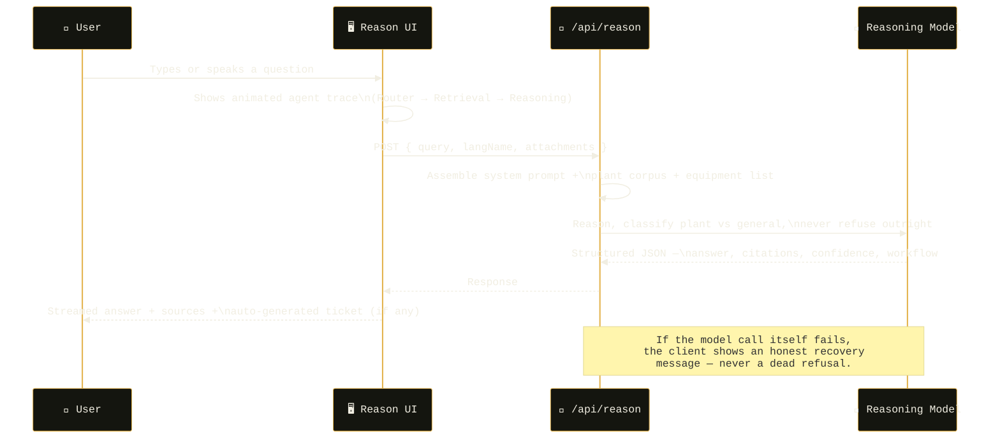

<div align="center">


<a href="https://cortex-seven-neon.vercel.app/" target="_blank">
  
</a>


&nbsp;

&nbsp;

&nbsp;

&nbsp;

&nbsp;


&nbsp;

&nbsp;

&nbsp;


> 🏆 **Built for ET AI Hackathon 2026 — Problem 8: Unified Asset & Operations Brain**
> Cortex ingests a plant's scattered documents — P&IDs, work orders, SOPs, inspections, incidents, regulations — and reasons across them the way an experienced engineer would, in 20 languages, on any phone.

</div>

## 📌 Quick Links

<div align="center">

| ❓ [Problem](#-problem-statement) | 💡 [Solution](#-solution) | 🏗️ [Architecture](#-system-architecture) |
|:---:|:---:|:---:|
| 🤖 [Reasoning Engine](#-reasoning-engine--pluggable-llm-backend) | ⚡ [Features](#-features) | 🗂️ [Project Structure](#-project-structure) |
| 🚀 [Deploy](#-deploy-your-own) | 📋 [Judging Criteria](#-judging-criteria-alignment) | 🗺️ [Roadmap](#-roadmap) |

</div>

## ❓ Problem Statement

<div align="center">

```
India's asset-intensive industries run on paperwork that never talks to itself.
A large plant operates across 7–12 disconnected document systems — P&IDs in one
place, maintenance records in another, safety procedures in a third — and the
intelligence layer to connect them across a shift, a department, or a decade
never gets built. The cost isn't filed away. It shows up as downtime, audits
failed, and — in the worst case — lives lost.
```

</div>



```mermaid
%%{init: {'theme': 'base', 'themeVariables': {'primaryColor': '#14150F', 'primaryTextColor': '#F1EEE2', 'primaryBorderColor': '#E3B34D', 'lineColor': '#E3B34D', 'secondaryColor': '#1D2016', 'tertiaryColor': '#0E0F0A', 'background': '#0E0F0A', 'mainBkg': '#14150F', 'nodeBorder': '#E3B34D', 'clusterBkg': '#1D2016', 'titleColor': '#F1EEE2', 'edgeLabelBackground': '#14150F', 'fontFamily': 'monospace'}}}%%
flowchart LR
    subgraph GAP ["🚨 Data Present, Unacted Upon"]
        direction TB
        A["📄 Documents Exist\nP&IDs · work orders · SOPs\nInspections · incidents"]
        B["🔌 Never Connected\n7–12 disconnected systems\nper large plant"]
        C["⏳ 35% of Engineer Time\nSpent searching, not solving\nMcKinsey 2024"]
        D["⚠️ Warnings Missed\nSignal existed. No layer\nconnected it in time."]
    end

    subgraph COST ["📉 What It Actually Costs"]
        direction TB
        E["6,500+ Fatal Accidents\nFY2023 · DGFASLI"]
        F["25% of Engineers\nRetire within a decade —\nknowledge leaves with them"]
        G["Compliance Gaps\nFound at audit, not\nbefore it"]
        H["Vizag Steel Plant, Jan 2025\n8 workers died. Gas sensors\nworked. Nobody connected them."]
    end

    GAP --> COST

    style A fill:#1D2016,stroke:#4FE0B0,color:#4FE0B0
    style B fill:#1D2016,stroke:#FFC24B,color:#FFC24B
    style C fill:#1D2016,stroke:#7FD8FF,color:#7FD8FF
    style D fill:#241414,stroke:#FF5C5C,color:#FF5C5C
    style E fill:#241414,stroke:#FF5C5C,color:#FF7A7A
    style F fill:#1D2016,stroke:#FFC24B,color:#FFD98A
    style G fill:#1D2016,stroke:#B69CFF,color:#C9B3FF
    style H fill:#241414,stroke:#FF5C5C,color:#FF7A7A
    style GAP fill:#0E0F0A,stroke:#FF5C5C,stroke-width:2px,color:#F1EEE2
    style COST fill:#0E0F0A,stroke:#E3B34D,stroke-width:2px,color:#F1EEE2
```

| # | The Gap | Source |
|---|---------|--------|
| 💀 | **6,500+ fatal workplace accidents** recorded in FY2023 | DGFASLI |
| ⏳ | **35% of engineers' time** spent searching for information across disconnected systems | McKinsey, 2024 |
| 🗂️ | **7–12 disconnected document systems** per large plant | NASSCOM–EY |
| 🎓 | **25% of India's experienced engineers** retire within the decade — undocumented knowledge leaves with them | Industry estimate |
| ⚠️ | **Vizag Steel Plant, Jan 2025** — 8 workers died when a coke-oven battery exploded; gas sensors were working, warnings existed, nothing connected them in time | Reported by The Wire |

## 💡 Solution



Not a chatbot. Not a single LLM call over a stack of PDFs. A router classifies every query, specialist agents pull relevant grounding when it exists, and a reasoning pass connects signals across documents no single one of them reveals alone — then it **always answers**, whether the question is about a specific pump or just "2+2."

## 🏗️ System Architecture



### 🔄 Request Lifecycle



## 🤖 Reasoning Engine — Pluggable LLM Backend

Cortex's `/api/reason` route is provider-agnostic by design: the system prompt, JSON contract, and always-answer logic are identical regardless of which model is behind them. Swap providers by replacing one file and one environment variable — nothing else in the app changes.

| | Gemini | OpenAI | Grok (xAI) |
|---|---|---|---|
| **Env var** | `GEMINI_API_KEY` | `OPENAI_API_KEY` | `XAI_API_KEY` |
| **Model** | `gemini-3.5-flash` | `gpt-4o-mini` | `grok-4.1-fast-non-reasoning` |
| **PDF uploads** | ✅ Native | ✅ Native | ❌ Not supported |
| **Image uploads** | ✅ Native | ✅ Native | ✅ Native (vision) |
| **Free tier** | ✅ Yes | ❌ Pay-as-you-go | ✅ Limited free credits |
| **Get a key** | aistudio.google.com/apikey | platform.openai.com | console.x.ai |

> Every provider enforces the same rule: **the model must always answer.** If the plant corpus has nothing relevant, it says so in one sentence and still answers from general knowledge — it never dead-ends on a bare refusal, whether the question is "what's the status of P-101" or just "2+2."

## ✨ Features

<table>
<tr>
<td width="50%" valign="top">

### 🧠 Reason
- Multi-agent chat — Router, Retrieval, Maintenance & RCA, Safety, Compliance, Reasoning, Synthesis
- **Voice input** in the selected language (Web Speech API)
- **Upload or scan** documents — PDF or camera photo — and ask about them directly
- Live animated agent trace, streamed answers, source citations
- Auto-generates a maintenance ticket / RCA / compliance pack from any answer

### 🕸️ Neural Map
- The knowledge graph as a **real D3 force simulation** — not a static diagram
- Drag any node, scroll to zoom
- Highlights the exact reasoning trail from your last query

### 🏭 Digital Twin
- Live blueprint of the plant with ticking sensor values
- Tap any asset to inspect its status and linked records, or ask Cortex about it directly

</td>
<td width="50%" valign="top">

### 🛡️ Compliance
- Audit-readiness score computed from the same corpus Cortex reasons over
- Open deviations list with one-click evidence-pack generation
- Regulation-by-regulation compliance status

### ✅ Workflows
- Persistent kanban board — Open / In Progress / Done
- Tickets generated from Reason or Compliance land here automatically
- Drag-to-reorder (Framer Motion), manual task entry

### 🌐 Built for India
- **20 languages** — 12 Indian (with full right-to-left support for Urdu) + 8 global
- Installable as a **PWA** — QR code to home screen, no app store, works on iOS and Android

</td>
</tr>
</table>

## 📱 Scan to Try Cortex Live

<div align="center">


**Scan to try Cortex live**
No app store, no install step — the PWA adds itself to your home screen straight from the browser.

[](https://cortex-seven-neon.vercel.app/)

</div>

## 🗂️ Project Structure

```
Cortex/
│
├── app/
│   ├── api/reason/route.ts      # Server route — calls the reasoning model, key never exposed
│   ├── layout.tsx                # Fonts, metadata, PWA manifest wiring
│   ├── page.tsx                  # Renders <AppShell/>
│   └── globals.css
│
├── components/
│   ├── AppShell.tsx               # Boot sequence, header, sidebar, animated view switch
│   ├── Header.tsx / Sidebar.tsx    # Plant switcher, live alerts, language picker
│   ├── ThreeField.tsx              # WebGL reasoning-core scene (Three.js)
│   ├── AnswerCard.tsx / ReasoningTrace.tsx
│   ├── views/
│   │   ├── Reason.tsx              # Chat, voice, upload/scan, drag-drop
│   │   ├── NeuralMap.tsx           # D3 force-directed graph
│   │   ├── Twin.tsx                 # Digital twin blueprint
│   │   ├── Sources.tsx             # Document corpus browser
│   │   ├── Compliance.tsx          # Audit dashboard
│   │   ├── Workflows.tsx           # Kanban board
│   │   └── Agents.tsx              # Agent roster + pipeline
│   └── ui/                          # Hand-authored shadcn-style primitives
│
├── lib/
│   ├── data.ts                     # Plant corpus: equipment, docs, graph, agents
│   ├── i18n.ts                      # 20 languages
│   ├── store.ts                     # Zustand store (persisted)
│   └── types.ts
│
├── public/
│   └── manifest.json, icons        # PWA installability
│
├── assets/
│   └── qr-code.png                  # QR code linking to the live demo (used in this README)
│
├── .github/workflows/
│   └── build-check.yml              # Typecheck + build on every push, before Vercel ever sees it
│
└── scripts/
    └── gen_icons.py                 # Renders the app icon set for the PWA manifest
```

## 🚀 Deploy Your Own

### Prerequisites
- GitHub account
- Vercel account (free)
- One reasoning-model API key — see the [provider table](#-reasoning-engine--pluggable-llm-backend) above for where to get one

### Step 1 — Clone
```bash
git clone https://github.com/debasmita30/Cortex.git
cd Cortex
npm install
```

### Step 2 — Local env
```bash
cp .env.example .env.local
# paste your chosen provider's key into .env.local
npm run dev
```

### Step 3 — Deploy to Vercel
1. Push to GitHub, import the repo at [vercel.com/new](https://vercel.com/new)
2. **Settings → Environment Variables** → add the env var matching your chosen `route.ts` (`GEMINI_API_KEY`, `OPENAI_API_KEY`, or `XAI_API_KEY`) for **Production and Preview**
3. Deploy
4. Every push to `main` runs `.github/workflows/build-check.yml` first — typecheck and build, so a broken file shows red on GitHub before it ever reaches a Vercel build

> ⚠️ **The env var name must match exactly what `app/api/reason/route.ts` reads**, and a deploy must run *after* the variable is set — editing an env var never applies retroactively to an existing deployment.

## 🛠️ Tech Stack

<div align="center">

| Layer | Technology | Purpose |
|---|---|---|
| **Framework** | Next.js 14 (App Router) | Server + client in one deployable app |
| **Language** | TypeScript (strict) | Typechecked end-to-end, incl. the API route |
| **Styling** | Tailwind CSS | Utility-first, dark "black-olive" theme |
| **Motion** | Framer Motion | Spring-based transitions, sliding nav indicator, kanban reorder |
| **Graph physics** | D3 (force, drag, zoom) | Real, draggable knowledge graph |
| **3D / WebGL** | Three.js | Ambient reasoning-core scene |
| **State** | Zustand (persisted) | Language, uploads, workflows, plant selection |
| **Icons** | lucide-react | Consistent line-icon set |
| **Reasoning** | Gemini / OpenAI / Grok (pluggable) | Server-side only, key never exposed |
| **Hosting** | Vercel | Auto-deploy on push, global CDN |
| **CI** | GitHub Actions | Build check on every push and PR |

</div>

## 📋 Judging Criteria Alignment

| Criterion | How Cortex Addresses It |
|---|---|
| **Relevance to Problem Statement** | Purpose-built for Problem 8 — Unified Asset & Operations Brain |
| **Innovation & Creativity** | Multi-agent reasoning pipeline, not a single retrieval call over PDFs |
| **Technical Implementation** | Real WebGL, real D3 physics, typed end-to-end, CI-checked on every push |
| **Business Viability** | Turns every answer into a real artifact — ticket, RCA, compliance pack |
| **Presentation & Clarity** | 20 languages, voice input, installable PWA — built to demo on any device |
| **Impact & Scalability** | Grounded in real regulation (OISD, Factory Act 1948); pluggable backend and multi-plant switcher designed for onboarding beyond one site |

## 🗺️ Roadmap

> These are honest next steps, not hackathon-day claims. The current demo is fully functional without them.

- **Bhashini / Sarvam voice integration** — production-grade regional-language voice that also works reliably on iOS
- **Real ingestion pipeline** — OCR and P&ID parsing beyond the curated demo corpus
- **Multi-plant onboarding** — the plant switcher already has two additional sites stubbed and ready
- **Postgres-backed persistence** — replacing local storage for genuine multi-user deployment

---

<div align="center">


**Built for ET AI Hackathon 2026 · Problem 8 — Unified Asset & Operations Brain**

[](https://cortex-seven-neon.vercel.app/)

*Every scattered document. One reasoning brain.*

</div>
